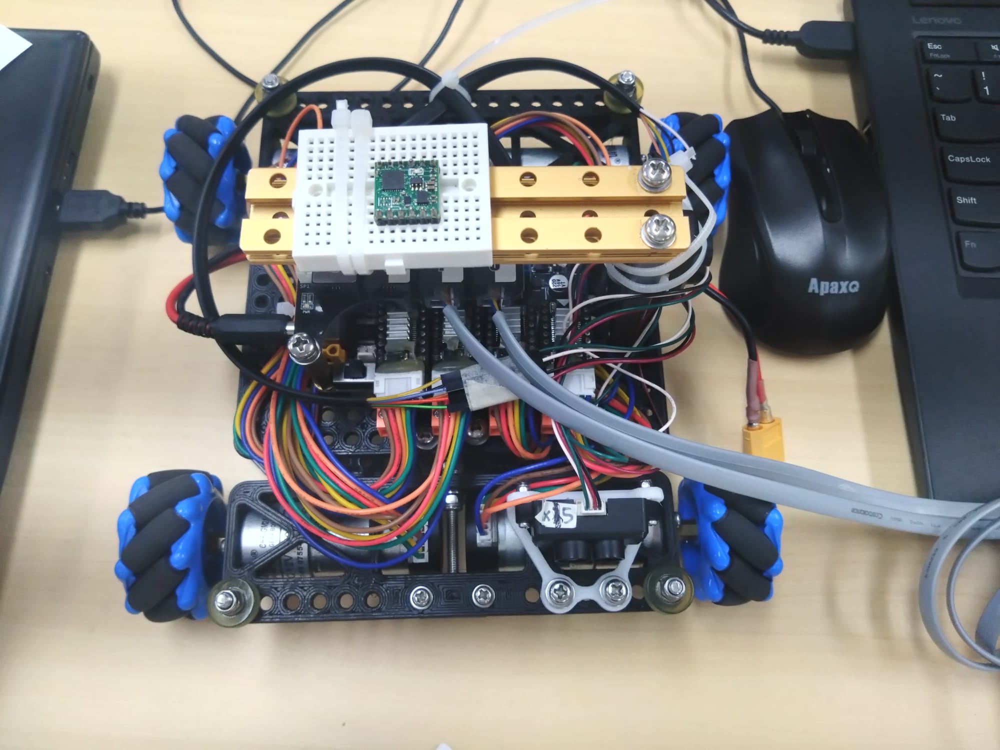

# Memo of Meeting held on Jun 19
The following is an account of minutes held on Jun 19, 0930 - 1040 at Room 309. The minute is a record of the decisions made to the upcoming `編程基礎班` and `編程進階班` discussed by the attendees.

## Background
Please refer to `20230519暑期活動-1.pdf`.

## Attendees
- Mr. Hui Shek Hin (Issac)
- Tam Ka Yiu (I. Tam)
- Chong Ngai Chun Adrian (Adrian Chong)
- Mr. Hung Kam Fai (Hung Sir)

# 編程基礎班 (Lesson 1-3)

### Programme Objectives
- Understand the hardware of Arduino
- Understand the use and applications of Digital Signals
- Follow programming style guides (i.e basic variable naming conventions)
- Make use of a Control flow
- Use a Serial Monitor
- Understand the basics of Analogue I/O and PWM (Pulse width modulation) I/O

### Materials
The following materials should be provided for the students:
- Arduino Uno
- Breadboard
- LED
- Button
- (...Optional) Gyroscope sensor

### Tasks
- Circut wiring using the breadboard
- [Wire and Program a Button](https://docs.arduino.cc/built-in-examples/digital/Button)
- [Blink (Button-LED Set)](https://docs.arduino.cc/built-in-examples/basics/Blink)
- (...Optional) Read gyroscope data on Serial Port

# 編程進階班 (Lesson 4-??)
## Tasks
Build and program a Mecanum wheel-based non-wireless remote vehicle based on given assembly instructions

## Objectives
- Understand advanced Software Enginnering concepts, i.e Functions, Objects, Class and Object-oriented programming
- Write large program under the guideline of a sytle guide
- (...Optional: Gyro) use of extenal libraries

### Materials
The following materials should be provided for the students:
- Assembly Instructions
- Makebot Pinout
- Joysticks
- (...Optional) Gyro
- (...Shown as photo)
- (...TBC)

# Others
Complex concepts (i.e 2's complement and bitwise operation) should not be included in the tutorial.